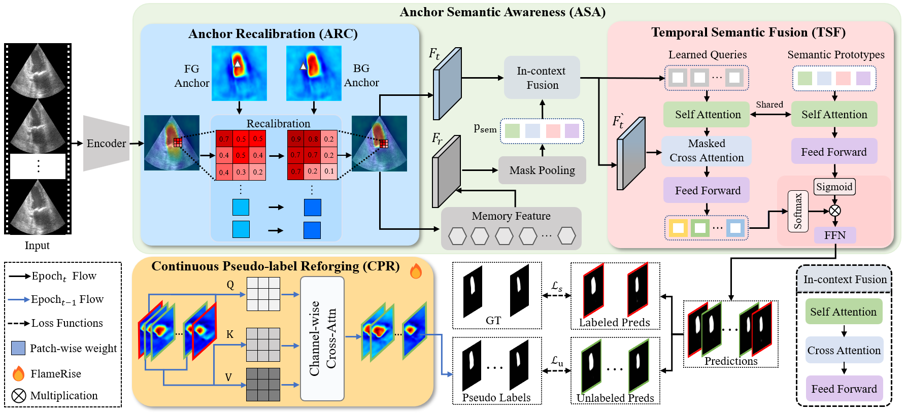

# EchoForge
[CVPR 2026] Official implementation of "Semi-supervised Echocardiography Video Segmentation via Anchor Semantic Awareness and Continuous Pseudo-label Reforging".

# Notes
The code is coming soon.
